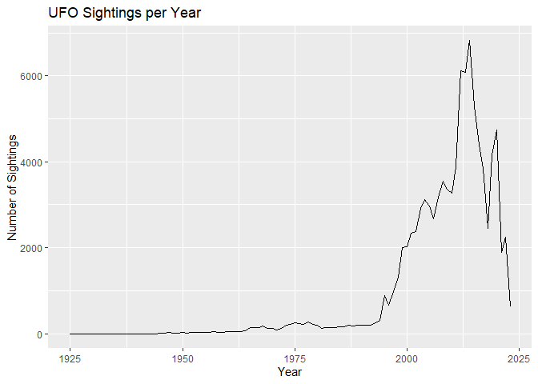

<!-- README.md is generated from README.Rmd. Please edit that file -->

# ufoPackage

<!-- badges: start -->
<!-- badges: end -->

The ufoPackage aims to provide tools for exploring and analyzing UFO
sighting data. This package includes a cleaned dataset, a Shiny app for
interactive data exploration, and a set of functions designed to
facilitate further analysis.

## Installation

You can install the development version of ufoPackage from
[GitHub](https://github.com/rows0001) with:

``` r
devtools::install_github("ETC5523-2024/assignment-4-packages-and-shiny-apps-rows0001/ufopackage/ufoPackage")
#> Skipping install of 'ufoPackage' from a github remote, the SHA1 (10301e23) has not changed since last install.
#>   Use `force = TRUE` to force installation
```

## Data

The package includes a dataset containing UFO sightings, featuring
various attributes such as reported date, location, shape, and time of
sighting. The data is cleaned and processed to ensure consistency and
usability.

## Usage

This is a basic example which shows you how to solve a common problem:

``` r
library(ufoPackage)
## basic example code
```

## Load Data

Load the cleaned UFO sightings data:

``` r
data("ufo_sightings")  # Load the UFO sightings dataset
```

## Summary of Sightings

You can get a summary of the sightings data:

``` r
summary(ufo_sightings)
#>  reported_date_time               reported_date_time_utc          
#>  Min.   :1925-12-28 19:00:00.00   Min.   :1925-12-29 00:00:00.00  
#>  1st Qu.:2004-10-03 01:11:00.00   1st Qu.:2004-10-03 05:11:00.00  
#>  Median :2012-02-05 22:22:30.00   Median :2012-02-06 03:22:30.00  
#>  Mean   :2009-04-30 20:31:37.81   Mean   :2009-05-01 00:31:37.81  
#>  3rd Qu.:2016-01-25 19:18:30.00   3rd Qu.:2016-01-26 00:18:30.00  
#>  Max.   :2023-05-18 15:27:00.00   Max.   :2023-05-18 19:27:00.00  
#>                                                                   
#>   posted_date             city               state        country_code  
#>  Min.   :1998-03-07   Length:96344       CA     :11472   US     :88213  
#>  1st Qu.:2006-10-30   Class :character   FL     : 5833   CA     : 3514  
#>  Median :2012-08-19   Mode  :character   WA     : 5055   GB     : 1818  
#>  Mean   :2011-09-27                      TX     : 4170   AU     :  602  
#>  3rd Qu.:2016-07-15                      NY     : 3854   IN     :  240  
#>  Max.   :2023-05-19                      AZ     : 3448   MX     :  143  
#>                                          (Other):62512   (Other): 1814  
#>       shape       reported_duration  duration_seconds      summary         
#>  light   :18894   Length:96344       Min.   :0.000e+00   Length:96344      
#>  circle  : 9361   Class :character   1st Qu.:3.000e+01   Class :character  
#>  triangle: 8977   Mode  :character   Median :1.800e+02   Mode  :character  
#>  fireball: 7270                      Mean   :3.164e+04                     
#>  other   : 6482                      3rd Qu.:6.000e+02                     
#>  (Other) :43323                      Max.   :1.987e+09                     
#>  NA's    : 2037                                                            
#>  has_images                   day_part        month          
#>  Mode :logical   night            :48505   Length:96344      
#>  FALSE:96344     afternoon        :12564   Class :character  
#>                  astronomical dusk:10391   Mode  :character  
#>                  nautical dusk    : 7652                     
#>                  morning          : 7513                     
#>                  (Other)          : 7171                     
#>                  NA's             : 2548                     
#>  day_of_week       
#>  Length:96344      
#>  Class :character  
#>  Mode  :character  
#>                    
#>                    
#>                    
#> 
```

## Plotting Sightings

To visualize sightings over the years:

``` r
# Summarize sightings per year
yearly_sightings <- ufo_sightings %>%
  mutate(year = format(as.POSIXct(reported_date_time, format = "%Y-%m-%d %H:%M:%S"), "%Y")) %>%
  group_by(year) %>%
  summarise(count = n(), .groups = 'drop')

# Plot
ggplot(yearly_sightings, aes(x = as.numeric(year), y = count)) +
  geom_line() +
  labs(title = "UFO Sightings per Year", x = "Year", y = "Number of Sightings")
```



## Shiny App

This package includes a Shiny app that allows users to interactively
explore the UFO sightings dataset. You can launch the app using the
following command:

``` r
#run_ufo_app()  # This function launches the Shiny app
```

## Shiny App Features

- Interactive Selection: Users can filter sightings based on different
  criteria such as year, shape, and location.
- Dynamic Outputs: The app updates visualizations and summaries based on
  user selections.
- User Guidance: Clear descriptions are provided to help users
  understand the dataset and how to interpret the outputs.

## Contribution

If you would like to contribute to ufoPackage, feel free to fork the
repository and submit a pull request. For any issues or feature
requests, please create an issue in the GitHub repository.

## License

This project is licensed under the MIT License - see the LICENSE file
for details.

## Acknowledgements

Special thanks to the sources of the UFO dataset and contributors to the
R community for their valuable resources.
